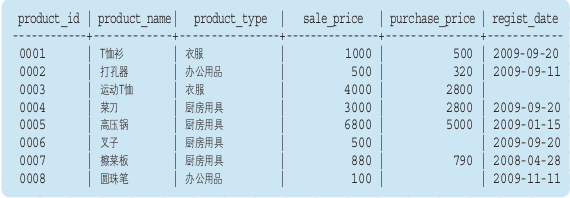
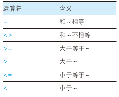
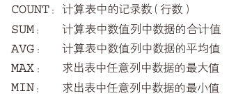
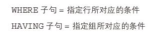
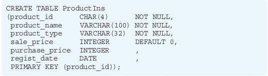
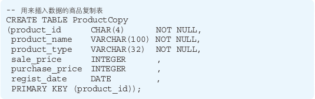

## 《SQL 基础教程 第2版》阅读笔记

### SQL 语句及其种类

根据对RDBMS赋予的指令种类的不同，SQL可以分为以下三类：

#### DDL 数据定义语言 (Data Definition Language) 

> 用来创建，删除或修改数据库和数据表

- CREATE
- DROP
- ALTER


#### DML 数据操纵语言 (Data Manipulation Language) 

> 用来查询或变更表中的记录

- SELECT
- INSERT
- UPDATE
- DELETE

#### DCL 数据控制语言 (Data Control Language) 

> 用来确认或取消对数据库中的数据进行的变更以及对 RDBMS 用户的权限进行设定

- COMMIT
- ROLLBACK
- GRANT
- REVOKE

### 基础查询

 

#### SQL 比较运算符

 

##### 不能对 NULL 使用比较运算符

~~`SELECT * FROM Product WHERE sale_price = NULL;`~~ 

应该使用 `IS NULL ` 运算符
```SQL
SELECT * FROM Product WHERE sale_price IS NULL;
```

#### SQL 逻辑运算符
##### NOT 运算符

`NOT` 不能单独使用，必须和其他查询条件组合起来使用。

```SQL
SELECT product_name, product_type, sale_price
FROM Product
WHERE NOT sale_price >= 1000;
```

`NOT` 运算用来否定某一条件，但是不能滥用，上面的SQL也可以替换为：

```SQL
SELECT product_name, product_type
FROM Product
WHERE sale_price < 1000;
```

##### AND 和OR 运算符

在 `WHERE` 子句中使用，可以对多个查询条件进行组合。

```SQL
SELECT product_name, purchase_price
FROM Product
WHERE product_type = ' 厨房用具 '
AND sale_price >= 3000;
```

### 聚合与排序

#### 聚合函数

5个常用的函数：

 

##### COUNT 函数注意事项

 

```SQL
SELECT COUNT(*), COUNT(col_1)
FROM NULLTb1;
```

将包含 NULL 的列作为参数时，COUNT(*) 和 COUNT(<列名>) 的结果并不相同，上述 SQL 输出 3 和 0

##### 使用 DISTINCT 关键字

```SQL
SELECT COUNT(DISTINCT product_type)
FROM Product;

SELECT DISTINCT product_type 
FROM Product;
```

#### 对表进行分组

##### GROUP BY 子句

```SQL
SELECT COUNT(product_type), product_type
FROM Product
GROUP BY product_type;
```

#### 为聚合结果指定条件

##### HAVING 子句

```SQL
/*不推荐的写法*/
SELECT COUNT(product_type), product_type
FROM Product
GROUP BY product_type
HAVING product_type = '衣服';

/*推荐的写法*/
SELECT COUNT(product_type), product_type
FROM Product
WHERE product_type = '衣服'
GROUP BY product_type;
/*推荐的写法*/
SELECT COUNT(product_type), product_type
FROM Product
GROUP BY product_type
HAVING COUNT(product_type) = 2;
```

上述两条SQL执行的结果是一致的，但是对应的条件写在WHERE子句中更好，也就是第二条SQL。

 

#### 对查询结果进行排序

##### ORDER BY 子句

```SQL
SELECT product_id, product_name, sale_price, purchase_price
FROM Product
ORDER BY sale_price DESC;
```

##### 指定多个排序键 

规则是优先使用左侧的键，如果该列存在相同值的话,再接着参考右侧的键，可以同时使用 3 个以上的排序键。

```SQL
SELECT product_id, product_name, sale_price, purchase_price
FROM Product
ORDER BY sale_price, product_id;
```

##### 在排序键中使用显示用的别名

在 `GROUP BY` 子句中不能使用 SELECT 子句中定义的别名，但是在 `ORDER BY` 子句中是允许使用别名的。

```SQL
SELECT product_id AS id, product_name, sale_price AS sp, purchase_price
FROM Product
ORDER BY sp, id;
```

##### ORDER BY 子句中可以使用的列

`ORDER BY` 子句中科院使用存在于表中，但并不包含在 SELECT 子句之中的列。

```SQL
SELECT product_name, sale_price, purchase_price
FROM Product
ORDER BY product_id;
```

还可以使用聚合函数

```SQL
SELECT product_type, COUNT(*)
FROM Product
GROUP BY product_type
ORDER BY COUNT(*);
```

### 数据更新

#### 数据的插入

 

##### INSERT 语句

```SQL
INSERT INTO ProductIns (product_id, product_name, product_type, sale_price, purchase_price, regist_date) 
VALUES ('0001', 'T 恤衫 ', ' 衣服 ', 1000, 500, '2009-09-20');
```

##### 插入 NULL

```SQL
INSERT INTO ProductIns (product_id, product_name, product_type, sale_price, purchase_price, regist_date) 
VALUES ('0006', ' 叉子 ', ' 厨房用具 ', 500, NULL, '2009-09-20');
```

##### 插入默认值

显式插入

```SQL
INSERT INTO ProductIns (product_id, product_name, product_type, sale_price, purchase_price, regist_date) 
VALUES ('0007', ' 擦菜板 ', ' 厨房用具 ', DEFAULT, 790, '2009-04-28');
```

隐式插入在插入数据时省略该列数据即可。

##### 从其他表中复制数据



`INSERT ... SELECT` 语句中的 `SELECT` 语句也可以使用 `WHERE` 子句或者 `GROUP BY` 子句等。

```SQL
INSERT INTO ProductCopy (product_id, product_name, product_type, sale_price, purchase_price, regist_date)
SELECT product_id, product_name, product_type, sale_price, purchase_price, regist_date
FROM Product;
```

#### 数据的删除

##### DROP TABLE 和 DELETE 语句

`DROP TABLE` 语句可以将表完全删除

`DELETE` 语句回流先表而删除表中全部的数据