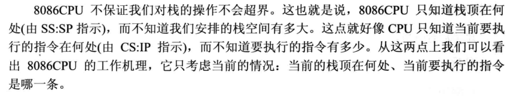

### 《汇编语言 第3版》阅读笔记

#### 第一章 基础知识

##### 汇编语言

汇编语言有以下3类指令组成。

- 汇编指令：机器码的助记符，有对应的机器码。

- 伪指令：没有对应的机器码，由编译器执行，计算机并不执行。

- 其他符号：如 +、-、*、/ 等由编译器识别，没有对应的机器码

汇编语言的核心是汇编指令，它决定了汇编语言的特性。

##### 存储器

指令和数据在存储器中存放，也就是我们平时所说的内存。数据和指令必须加载到内存中才能被 CPU 使用，离开了内存，性能再好的 CPU 也无法工作。

##### 指令和数据
指令和数据是应用上的概念，在内存或磁盘上，指令和数据没有任何区别，都是二进制信息。

##### 存储单元

存储器被划分为若干个存储单元，每个单元从0开始编号。微型机存储器的存储单元可以存储一个 Byte 即8个二进制位。

##### CPU对存储器的读写

CPU要想进行数据的读写，必须和芯片进行下面3类信息的交互：

- 存储单元的地址（地址信息）
- 读或写的命令（控制信息）
- 读或写的数据（数据信息）

##### 总线

总线从物理上来讲，就是一根根导线的集合。根据传送的信息的不同，逻辑上分为3类：地址总线，控制总线和数据总线。

 

##### 地址总线

CPU 通过地址总线来制定存储器单元，地址总线上能传送多少个不同的信息， CPU 就可以对多少个存储单元进行寻址。

一个 CPU 有 N 根地址线，则这个 CPU 的地址总线宽度为 N，这样的 CPU 最多可以寻找2的 N 次方个内存单元。

 

##### 数据总线

CPU 与内存或其他器件之间的数据传送是通过数据总线来进行的。数据总线的宽度决定 CPU 和外界的数据传送速度，8根数据总线一次可以传送一个字节，16根数据总线一次可以传送两个字节。

 

 

##### 控制总线

CPU 对外部器件的控制是通过控制总线来进行的，控制总线是一些不同控制线的集合，控制总线的宽度决定了 CPU 对外部器件的控制能力。

##### 主板

每一台 PC 中，都有一个主板，主板上有核心器件和一些主要器件，这些器件通过总线相连，如 CPU、存储器、外围芯片组、拓展插槽等，拓展插槽一般插有RAM内存条和各类接口卡。

##### 接口卡

CPU 对外部设备都不能直接控制，如显示器、音箱等，直接控制这些设备的是插在拓展插槽上的接口卡，拓展插槽通过总线和 CPU 相连，CPU 通过直接控制接口卡来间接控制外设。

##### 存储器芯片种类

从读写属性上看分为随机存储器 (RAM) 和只读存储器 (ROM)。

- RAM可读写，必须带点存储，断电内容丢失。
- ROM只读，断电内容不丢失。

 

##### 内存地址空间

 

##### 小结

 

 

#### 第二章 寄存器

##### 常用寄存器

8086 有8个8位数据寄存器，可分别组成16位寄存器：

- AH&AL＝AX：累加寄存器，常用于运算
- BH&BL＝BX：基址寄存器，常用于地址索引
- CH&CL＝CX：计数寄存器，常用于计数
- DH&DL＝DX：数据寄存器，常用于数据传递

  

##### 段地址寄存器

为了运用所有的内存空间，8086设定了四个段寄存器，专门用来保存段地址：

- CS（Code Segment）：代码段寄存器
- DS（Data Segment）：数据段寄存器
- SS（Stack Segment）：堆栈段寄存器
- ES（Extra Segment）：附加段寄存器

##### 特殊功能的寄存器

- IP（Intruction Pointer）：指令指针寄存器，与CS配合使用，可跟踪程序的执行过程
- SP（Stack Pointer）：堆栈指针，与SS配合使用，可指向目前的堆栈位置
- BP（Base Pointer）：基址指针寄存器，可用作SS的一个相对基址位置
- SI（Source Index）：源变址寄存器可用来存放相对于DS段之源变址指针
- DI（Destination Index）：目的变址寄存器，可用来存放相对于 ES 段之目的变址指针
- FR（Flag Register）：标志寄存器，有9个有意义的标志

***8086机中，任意时刻，CPU 将 CS:IP 指向的内容当做指令执行。***

##### 物理地址=段地址x16+偏移地址

 

 

##### 8086 CPU 读取，执行指令的工作原理

##### Debug 工具的使用

 

 #### 第三章 寄存器（内存访问） 

##### mov 指令

 

***SS:SP指向当前栈顶的地址***

##### CPU 提供的栈机制

 

##### 栈顶越界问题

 

